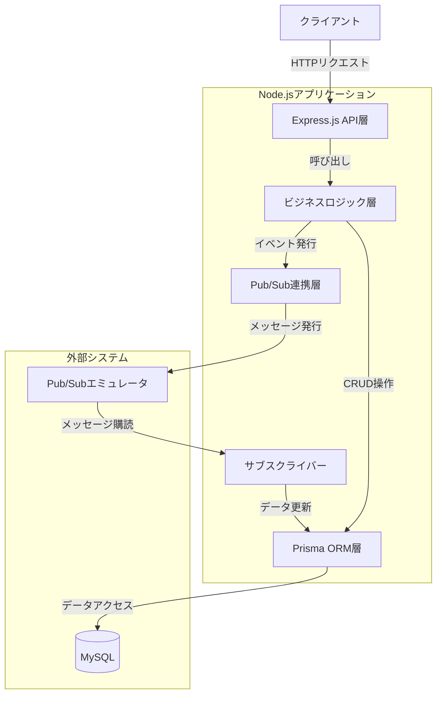
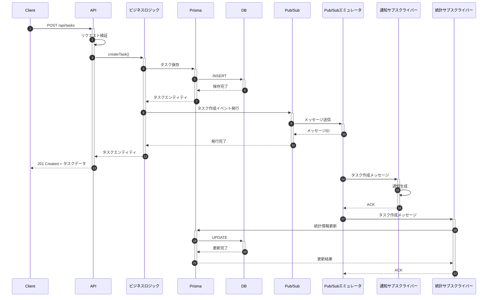
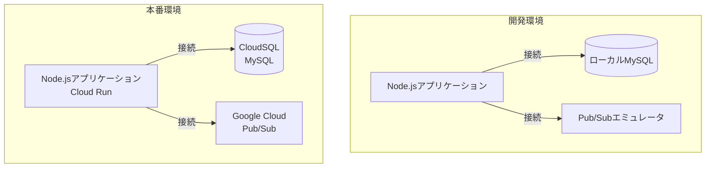

# Node.js タスク管理システム アーキテクチャ

このドキュメントでは、Node.js Pub/Subプロジェクトのアーキテクチャと主要コンポーネントについて説明します。

## アーキテクチャ概要

このシステムは、モノリスアプリケーション内でPub/Subパターンを活用したイベント駆動型のアーキテクチャを採用しています。APIリクエストの処理と、それに伴う副作用（通知や統計情報の更新など）を分離し、システムの拡張性と保守性を高めています。

## システム構成図

## コンポーネント説明

### 1. Express.js API層

- RESTful APIエンドポイントを提供
- ルーティングとコントローラーの実装
- リクエストバリデーション
- エラーハンドリングとレスポンス形成

### 2. ビジネスロジック層

- タスク管理のコアロジック
- ドメインモデルの実装
- トランザクション管理
- イベント発行の起点

### 3. Prisma ORM層

- データベースアクセスを抽象化
- タイプセーフなクエリ構築
- マイグレーション管理
- リレーショナルデータマッピング

### 4. Pub/Sub連携層

- イベントの発行（パブリッシャー）
- トピックの管理
- メッセージのシリアライズ

### 5. サブスクライバー

- イベント購読と処理
- 通知処理
- 統計情報更新
- 冪等性の確保

### 6. 外部システム

- **MySQL**: 永続データストレージ
- **Pub/Subエミュレータ**: ローカル開発用のGoogle Cloud Pub/Subエミュレーション

## データフロー

### タスク作成フロー

## 拡張性と将来の発展

このアーキテクチャは以下の拡張に対応できるよう設計されています：

1. **新しいサブスクライバーの追加**: 既存のイベントを購読して新しい機能を実装
2. **マイクロサービスへの移行**: Pub/Sub連携を活用して段階的な分割が可能
3. **スケールアウト**: サブスクライバー処理を独立してスケーリング
4. **新しいイベントタイプの追加**: 既存のインフラを再利用して新機能をサポート

## デプロイ構成

開発環境と本番環境の構成の違いは以下の通りです：

