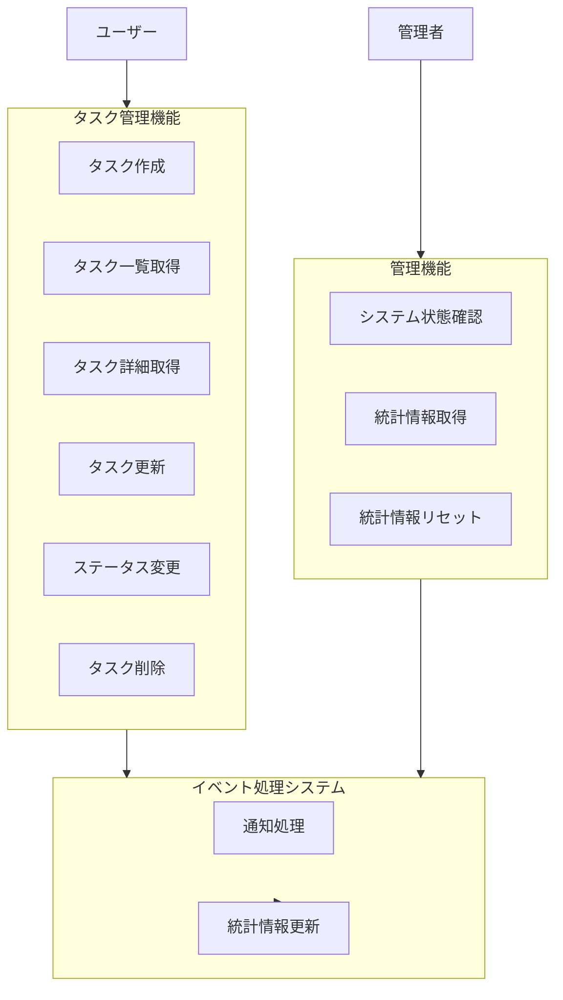

# Node.js タスク管理システム ユースケース

このドキュメントでは、Node.js Pub/Subプロジェクトで実装されているユースケースについて説明します。

## ユースケース概要

このシステムは主に3つのアクターに対するユースケースを提供します：

1. 一般ユーザー（タスク管理者）
2. システム（イベント処理）
3. 管理者（システム監視）

## 1. ユーザーとしてのタスク管理

一般ユーザーは以下のタスク管理操作を実行できます：

### 1.1 タスクの作成

**説明**: ユーザーは新しいタスクを作成できます。  
**入力**: タイトル、説明（オプション）、優先度、期限（オプション）  
**前提条件**: なし  
**フロー**:

1. ユーザーがタスク情報を入力
2. システムがタスクをデータベースに保存
3. システムがタスク作成イベントを発行
4. システムが作成されたタスク情報を返却

### 1.2 タスク一覧の取得

**説明**: ユーザーはタスクの一覧を取得できます。  
**入力**: フィルター条件（ステータス、優先度など）、ソート条件、ページネーション情報  
**前提条件**: なし  
**フロー**:

1. ユーザーが一覧取得をリクエスト（オプションでフィルター条件など）
2. システムが条件に合致するタスクをデータベースから取得
3. システムがタスク一覧を返却

### 1.3 タスク詳細の取得

**説明**: ユーザーは特定のタスク詳細を取得できます。  
**入力**: タスクID  
**前提条件**: 指定されたIDのタスクが存在すること  
**フロー**:

1. ユーザーがタスクIDを指定して詳細取得をリクエスト
2. システムが該当するタスクをデータベースから取得
3. システムがタスク詳細を返却

### 1.4 タスクの更新

**説明**: ユーザーは既存のタスク情報を更新できます。  
**入力**: タスクID、更新するフィールド（タイトル、説明、優先度、期限）  
**前提条件**: 指定されたIDのタスクが存在すること  
**フロー**:

1. ユーザーがタスクIDと更新情報を指定
2. システムがデータベース内のタスクを更新
3. システムがタスク更新イベントを発行
4. システムが更新されたタスク情報を返却

### 1.5 タスクステータスの変更

**説明**: ユーザーはタスクのステータスを変更できます。  
**入力**: タスクID、新しいステータス（TODO、IN_PROGRESS、DONE）  
**前提条件**: 指定されたIDのタスクが存在すること  
**フロー**:

1. ユーザーがタスクIDと新しいステータスを指定
2. システムがタスクのステータスを更新
3. システムがタスクステータス変更イベントを発行
4. システムが更新されたタスク情報を返却

### 1.6 タスクの削除

**説明**: ユーザーは不要なタスクを削除できます。  
**入力**: タスクID  
**前提条件**: 指定されたIDのタスクが存在すること  
**フロー**:

1. ユーザーがタスクIDを指定して削除をリクエスト
2. システムがデータベースからタスクを削除
3. システムがタスク削除イベントを発行
4. システムが削除完了を通知

## 2. システムとしてのイベント処理

システムは以下のイベント処理を自動的に実行します：

### 2.1 タスク作成通知

**説明**: 新規タスク作成時に通知を生成します。  
**トリガー**: タスク作成イベント  
**フロー**:

1. タスク作成イベントを受信
2. 通知内容を生成（このPoCではログ出力のみ）
3. 処理完了を確認（メッセージのACK）

### 2.2 タスク更新通知

**説明**: タスク更新時に通知を生成します。  
**トリガー**: タスク更新イベント  
**フロー**:

1. タスク更新イベントを受信
2. 変更内容を含む通知を生成
3. 処理完了を確認（メッセージのACK）

### 2.3 タスクステータス変更通知

**説明**: タスクステータス変更時に通知を生成します。  
**トリガー**: タスクステータス変更イベント  
**フロー**:

1. タスクステータス変更イベントを受信
2. ステータス変更に関する通知を生成
3. 処理完了を確認（メッセージのACK）

### 2.4 統計情報更新

**説明**: タスク関連イベント発生時に統計情報を更新します。  
**トリガー**: タスク作成、更新、削除、ステータス変更イベント  
**フロー**:

1. タスク関連イベントを受信
2. イベントタイプに応じて統計情報を更新
   - 総タスク数
   - ステータス別タスク数
   - 優先度別タスク数
   - 日次作成・完了数
3. 処理完了を確認（メッセージのACK）

## 3. 管理者としての利用

管理者は以下の操作を実行できます：

### 3.1 システム状態の確認

**説明**: システムの稼働状態を確認します。  
**入力**: なし  
**前提条件**: なし  
**フロー**:

1. 管理者がヘルスチェックエンドポイントにアクセス
2. システムが現在のステータスを返却

### 3.2 統計情報の取得

**説明**: タスクに関する統計情報を取得します。  
**入力**: なし  
**前提条件**: なし  
**フロー**:

1. 管理者が統計情報エンドポイントにアクセス
2. システムがタスクの統計情報を返却

### 3.3 統計情報のリセット（開発用）

**説明**: 統計情報をリセットし、現在のデータベース状態に基づいて再集計します。  
**入力**: なし  
**前提条件**: なし  
**フロー**:

1. 管理者が統計情報リセットエンドポイントにアクセス
2. システムが統計情報をリセット
3. システムが再計算された統計情報を返却

## ユースケース図

